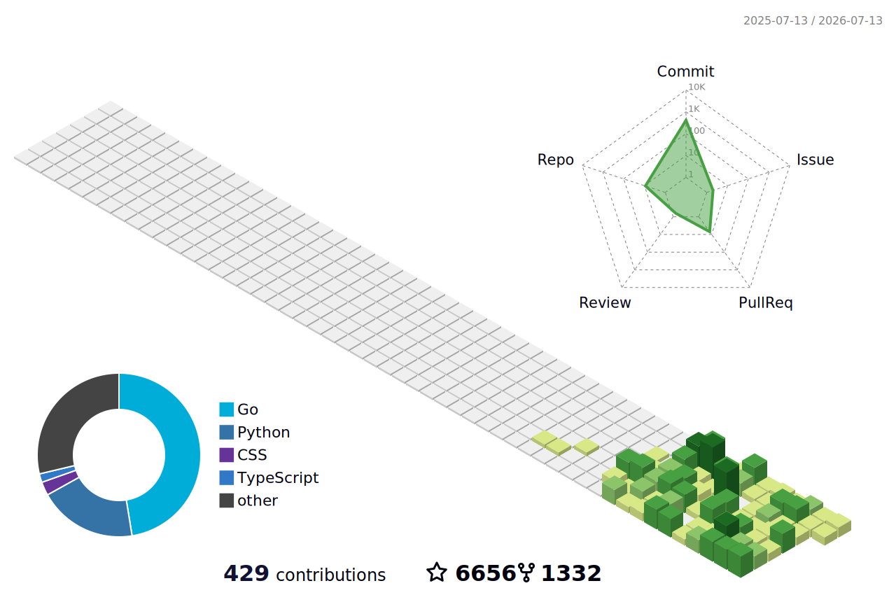

# cxuanAI

**AI systems · Automation · Local-first tools**

  <strong>中文</strong>
  &nbsp;·&nbsp;
  <a href="./README_EN.md">English</a>
  &nbsp;·&nbsp;
  <a href="https://github.com/crisxuan?tab=repositories">Projects</a>
  &nbsp;·&nbsp;
  <a href="https://galaxysite-inky.vercel.app/">Galaxy ↗</a>

 

长期折腾 Codex、Claude Code 和 Agent 工作流，记录真实踩坑、工具实测和产品判断。

## Contribution Arcade

<picture>
  <source media="(prefers-color-scheme: dark)" srcset="https://raw.githubusercontent.com/crisxuan/crisxuan/output/breakout-contribution-graph-dark.svg" />
  <source media="(prefers-color-scheme: light)" srcset="https://raw.githubusercontent.com/crisxuan/crisxuan/output/breakout-contribution-graph.svg" />
  
</picture>

Breakout 正在击碎过去一年的贡献格子 · 每天自动更新

## 我在折腾什么

- **Codex / Claude Code** — 真实使用中的配置、协作方式和踩坑记录。
- **Agent 工作流** — 把任务拆解、工具调用、检查与交付串成可复用的流程。
- **AI 产品实测** — 记录新工具在真实场景里的效果、成本和是否值得用。

<strong>Stack</strong>

 

<table>
  <tr>
    <td align="center" width="11.11%"> TypeScript</td>
    <td align="center" width="11.11%"> React</td>
    <td align="center" width="11.11%"> Next.js</td>
    <td align="center" width="11.11%"> Vue</td>
    <td align="center" width="11.11%"> Electron</td>
    <td align="center" width="11.11%"> Go</td>
    <td align="center" width="11.11%"> Java</td>
    <td align="center" width="11.11%"> Spring</td>
    <td align="center" width="11.11%"> Node.js</td>
  </tr>
  <tr>
    <td align="center"> Python</td>
    <td align="center"> FastAPI</td>
    <td align="center"> PostgreSQL</td>
    <td align="center"> Redis</td>
    <td align="center"> Docker</td>
    <td align="center"> Kubernetes</td>
    <td align="center"> OpenAI</td>
    <td align="center"> Anthropic</td>
  </tr>
</table>

<strong>3D Contribution Map</strong>

<picture>
  <source media="(prefers-color-scheme: dark)" srcset="./profile-3d-contrib/profile-night-rainbow.svg" />
  <source media="(prefers-color-scheme: light)" srcset="./profile-3d-contrib/profile-green-animate.svg" />
  
</picture>

<strong>Elsewhere</strong>

 

<table>
  <tr>
    <td align="center" width="33.33%">
      <a href="https://galaxysite-inky.vercel.app/"> <strong>Galaxy Site</strong> 产品与实验</a>
    </td>
    <td align="center" width="33.33%">
      <a href="https://www.zhihu.com/people/bycxuan"> <strong>知乎</strong> 深度文章</a>
    </td>
    <td align="center" width="33.33%">
      <a href="https://juejin.cn/user/2101921964109880"> <strong>掘金</strong> 技术笔记</a>
    </td>
  </tr>
  <tr>
    <td align="center">
      <a href="https://x.com/criscxuan"> <strong>X</strong> @criscxuan</a>
    </td>
    <td align="center">
      <a href="https://www.xiaohongshu.com/user/profile/5a12e9f8e8ac2b34c7cfea22"> <strong>小红书</strong> 日常记录</a>
    </td>
    <td align="center">
       <strong>微信</strong> 公众号 cxuanAI · 微信 lx252279279
    </td>
  </tr>
</table>

