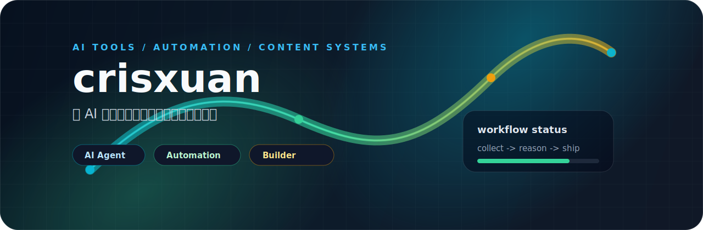

  

 

  
  
  

 

## 关于我

我在做把 AI 放进真实工作流里的产品和工具，关注从信息采集、内容生成、平台分发到本地知识管理的完整链路。偏爱快速做出能跑的系统，再把体验、自动化和工程质量一点点打磨到可靠。

目前主要在探索：

- AI Agent 与自动化工作流：让工具替人完成重复决策、整理和发布。
- 内容系统：采集、去重、重写、排版、多平台分发。
- 桌面与本地优先应用：更重视隐私、离线能力和个人数据掌控。
- 开源项目发现：把 GitHub 上值得关注的项目筛出来、解释清楚、持续追踪。

## 技术栈

  

 

  
  
  
  
  
  

## 代表项目

<table>
  <tr>
    <td width="50%">
      <h3>PreHub</h3>
      
GitHub 项目发现产品：用搜索、评分、审核和每日精选把值得关注的开源项目筛出来。

      
<a href="https://github.com/crisxuan/prehub">github.com/crisxuan/prehub</a>

    </td>
    <td width="50%">
      <h3>searchnews / autowriting</h3>
      
可串行执行的内容流水线：采集、LLM 渲染、平台适配，并发布到公众号、知乎、掘金、小红书。

      
<a href="https://github.com/crisxuan/autowriting">github.com/crisxuan/autowriting</a>

    </td>
  </tr>
  <tr>
    <td width="50%">
      <h3>Layweout</h3>
      
面向微信公众号排版的本地工作台，把 Markdown / HTML 转成可复制到编辑器的内联样式 HTML。

      
<a href="https://github.com/crisxuan/layweout">github.com/crisxuan/layweout</a>

    </td>
    <td width="50%">
      <h3>PrivateTalk</h3>
      
微信聊天记录查看与分析工具，围绕本地数据、检索、可视化和 AI 问答做桌面体验。

      
<a href="https://github.com/crisxuan/privatetalk">github.com/crisxuan/privatetalk</a>

    </td>
  </tr>
</table>

## GitHub 动态

  
  

  

## 近期关注

- 把内容生产从“写一篇”升级成“稳定运行的生产线”。
- 给个人数据做更好的本地检索、结构化分析和 AI 入口。
- 建立更聪明的开源项目发现机制，让好项目更早被看见。
- 做少一点重复劳动，多一点能长期复用的系统。

 

  Building useful AI-native tools, one workflow at a time.

