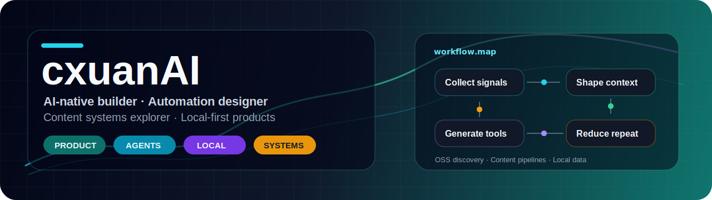

  
  
<strong>Building AI apps that survive real workflows and turning repetitive work into reusable systems.</strong>

  
  
  
  

 

<table>
  <tr>
    <td width="58%" valign="top">
      <h2>👋 About Me</h2>
      

        I am <strong>cxuanAI</strong>, a product-minded engineer focused on AI applications, automation workflows, content systems, and local-first tools.
      

      

        I like turning ideas into systems that can live in real scenarios: collecting information, understanding context, generating content, adapting it for different platforms, preserving useful data, and reducing repetitive work over time.
      

      

        This space collects my code experiments, tool prototypes, engineering notes, and explorations around AI-native ways of working.
      

    </td>
    <td width="42%" valign="top">
      <h2>🧭 Now</h2>
      
🔭 Building: AI project discovery, content production pipelines, local data workbenches

      
🧠 Studying: agent workflows, RAG, automated publishing, personal knowledge systems

      
🛠️ Daily stack: TypeScript / React / Next.js / Python / Go / Electron

      
🌱 Direction: local-first software, reusable systems, low-noise tools, durable products

    </td>
  </tr>
</table>

## 🚀 What I Am Building

<table>
  <tr>
    <td width="50%" valign="top">
      <h3>AI Project Discovery Engine</h3>
      
A workflow for searching, scoring, reviewing, and recommending open-source projects worth following.

      

        
        
      

    </td>
    <td width="50%" valign="top">
      <h3>Content Production Pipeline</h3>
      
A system that connects material collection, LLM-assisted writing, format adaptation, and multi-platform publishing.

      

        
        
      

    </td>
  </tr>
  <tr>
    <td width="50%" valign="top">
      <h3>Local Publishing Workbench</h3>
      
A Chinese content formatting workbench that turns Markdown and HTML into structured layouts for publishing platforms.

      

        
        
      

    </td>
    <td width="50%" valign="top">
      <h3>Local Data Analysis Tool</h3>
      
A local-first experience for personal data, search, visualization, and AI-assisted Q&A.

      

        
        
      

    </td>
  </tr>
</table>

## 🧰 Tech Stack

  

    <strong>Frontend / Desktop</strong>
     
    
    
    
    
    
    
    
    
  

  

    <strong>Backend / Services</strong>
     
    
    
    
    
    
    
    
    
  

  

    <strong>Data / Infrastructure</strong>
     
    
    
    
    
    
    
    
    
  

  

    <strong>Tooling / Platforms</strong>
     
    
    
    
    
    
    
    
    
  

  

    
    
    
    
    
    
  

## 🧩 How I Work

<table>
  <tr>
    <td width="25%" align="center">
      <strong>Discover</strong>
       
      Collect signals and find problems or projects worth tracking
    </td>
    <td width="25%" align="center">
      <strong>Design</strong>
       
      Turn workflows into stable, reusable system modules
    </td>
    <td width="25%" align="center">
      <strong>Automate</strong>
       
      Use AI and scripts to reduce repetitive decisions and operations
    </td>
    <td width="25%" align="center">
      <strong>Publish</strong>
       
      Adapt outputs to code, content, and real product scenarios
    </td>
  </tr>
</table>

## 🔗 Find Me

  
  
  
  

 

| Channel | Where | Good For |
| --- | --- | --- |
| Galaxy Site | [galaxysite-inky.vercel.app](https://galaxysite-inky.vercel.app/) | A visual map of my writing, code, and social platforms |
| GitHub | [@crisxuan](https://github.com/crisxuan) | Code, experiments, open-source work |
| Zhihu | [bycxuan](https://www.zhihu.com/people/bycxuan) | Long answers, opinions, structured thinking |
| X | [@criscxuan](https://x.com/criscxuan) | Short updates, building notes, real-time thoughts |
| Xiaohongshu | [cxuanAI](https://www.xiaohongshu.com/user/profile/5a12e9f8e8ac2b34c7cfea22) | Visual notes, life fragments, behind the scenes |
| CSDN | [qq_36894974](https://blog.csdn.net/qq_36894974?type=blog) | Technical articles and engineering notes |
| Juejin | [cxuanAI](https://juejin.cn/user/2101921964109880) | Frontend, engineering, and practical writeups |
| CNBlogs | [cxuanBlog](https://www.cnblogs.com/cxuanBlog) | Blog archive and technical writing |
| WeChat Official Account | `cxuanAI` | Search on WeChat for long-form Chinese articles |
| WeChat | `lx252279279` | Collaboration, project discussion, and direct contact |

## 🌟 Recent Focus

- Turning content creation from single articles into stable production systems.
- Building better local search, structured analysis, and AI entry points for personal data.
- Designing smarter open-source discovery workflows so good projects can be noticed earlier.
- Doing less repetitive work and more reusable system building.

 

  

